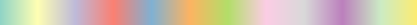
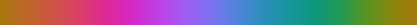

<div class="fluid-row" id="header">


<h1 class="title toc-ignore">ee-palettes</h1>
<h4 class="author"><em>Gennadii Donchyts, Fedor Baart &amp; Justin Braaten</em></h4>

</div>


<div id="about" class="section level1">
<h1>About</h1>
<p><em>ee-palettes</em> is a module for generating color palettes in <a href="https://earthengine.google.com/">Google Earth Engine</a> (EE) to be applied to mapped data.</p>
</div>
<div id="add-the-module" class="section level1">
<h1>Add the module</h1>
<p>Visit this <a href="https://code.earthengine.google.com/?accept_repo=users/gena/packages">URL</a> to add the module to the Reader repository of your EE account. After the module is added, you can find the source code in the Script Manager under: <em>Reader:users/gena/packages/palettes</em>.</p>
</div>
<div id="how-to-use" class="section level1">
<h1>How to use</h1>
<div id="load-the-module" class="section level4">
<h4>Load the module</h4>
<p>You can access the ee-palettes through the <code>require()</code> function. Running the following line will make the palettes available to you through JavaScript (JS) object access notation. The returned variable will be a nested series of JS objects ending in lists of hex colors.</p>

```javascript
var palettes = require('users/gena/packages:palettes');
```
</div>
<div id="define-a-palette" class="section level4">
<h4>Define a palette</h4>
<p>Find a palette you like from the list below. Each palette is defined by a group and a name, which are separated by a period (JS object dot notation), and a color level.</p>
<p>To retrieve a desired palette, use JS object notation to specify the group, name, and number of color levels. The number of colors available varies by palette, which are listed following the palette names below. Note that all non-ColorBrewer palettes have only 7 colors, so always use 7 as the ‘color levels’ property for these palettes.</p>

<p>After determining the palette group, name, and color level, set the palette as a variable.</p>

```javascript
var palette = palettes.colorbrewer.RdYlGn[9];
```

</div>
<div id="apply-a-palette" class="section level4">
<h4>Apply a palette</h4>
<p>To apply the defined palette to map data, set the palette variable as the value for the <code>palette</code> key in the <code>visParams</code> object supplied to the <code>Map.addLayer()</code> function. It is also helpful to determine and define appropriate <code>min</code> and <code>max</code> values to ensure a good stretch. The following is a simple <a href="https://code.earthengine.google.com/67377ff1bcf7654099a39638f84e15e2" target="_blank">example</a> of loading the <em>ee-palettes</em> module, defining a palette, and applying it to temperature data.</p>

```javascript
// Load some raster data: CONUS mean daily max temperature for January 2010
var tmax = ee.Image('OREGONSTATE/PRISM/AN81m/201001').select('tmax');

// Get a palette: a list of hex strings
var palettes = require('users/gena/packages:palettes');
var palette = palettes.misc.tol_rainbow[7];
 
// Display max temp with defined palette stretched between selected min and max
Map.addLayer(tmax, {min: -11, max: 25, palette: palette}, 'tmax');
```

</div>
</div>
<div id="palette-manipulation" class="section level1">
<h1>Palette manipulation</h1>
<div id="palette-reverse" class="section level4">
<h4>Palette reverse</h4>
<p>Reverse a palette with the <code>reverse()</code> function. Note that this will reverse the palette within the imported palette JS object, as well as the palette varible you happen to define. If you wish to leave the imported palette JS object unaltered, make a copy of the palette and then reverse it: <code>.slice(0).reverse()</code>.

```javascript
var palette = palettes.colorbrewer.RdYlGn[9].reverse();
```
  
</div>
<div id="palette-subset" class="section level4">
<h4>Palette subset</h4>
<p>If you only want to use a section of a palette, you can subset the colors you want using the <code>slice()</code> function. For instance, if you only want the pink to yellow section of the <em>misc.gnuplot</em> palette, use the following palette definition.</p>

```javascript
var palette = palettes.misc.gnuplot[7].slice(3,7);
```

</div>
</div>
<div id="palettes" class="section level1">
<h1>Palettes</h1>
<div id="colorbrewer-sequential" class="section level3">
<h3>ColorBrewer Sequential</h3>
<p> colorbrewer.Blues | 3,4,5,6,7,8,9<br/> colorbrewer.BuGn | 3,4,5,6,7,8,9<br/> colorbrewer.BuPu | 3,4,5,6,7,8,9<br/> colorbrewer.GnBu | 3,4,5,6,7,8,9<br/> colorbrewer.Greens | 3,4,5,6,7,8,9<br/> colorbrewer.Greys | 3,4,5,6,7,8,9<br/> colorbrewer.Oranges | 3,4,5,6,7,8,9<br/> colorbrewer.OrRd | 3,4,5,6,7,8,9<br/> colorbrewer.PuBu | 3,4,5,6,7,8,9<br/> colorbrewer.PuBuGn | 3,4,5,6,7,8,9<br/> colorbrewer.PuRd | 3,4,5,6,7,8,9<br/> colorbrewer.Purples | 3,4,5,6,7,8,9<br/> colorbrewer.RdPu | 3,4,5,6,7,8,9<br/> colorbrewer.Reds | 3,4,5,6,7,8,9<br/> colorbrewer.YlGn | 3,4,5,6,7,8,9<br/> colorbrewer.YlGnBu | 3,4,5,6,7,8,9<br/> colorbrewer.YlOrBr | 3,4,5,6,7,8,9<br/> colorbrewer.YlOrRd | 3,4,5,6,7,8,9<br/></p>
</div>
<div id="colorbrewer-diverging" class="section level3">
<h3>ColorBrewer Diverging</h3>
<p> colorbrewer.BrBG | 3,4,5,6,7,8,9,10,11<br/> colorbrewer.PiYG | 3,4,5,6,7,8,9,10,11<br/> colorbrewer.PRGn | 3,4,5,6,7,8,9,10,11<br/> colorbrewer.PuOr | 3,4,5,6,7,8,9,10,11<br/> colorbrewer.RdBu | 3,4,5,6,7,8,9,10,11<br/> colorbrewer.RdGy | 3,4,5,6,7,8,9,10,11<br/> colorbrewer.RdYlBu | 3,4,5,6,7,8,9,10,11<br/> colorbrewer.RdYlGn | 3,4,5,6,7,8,9,10,11<br/> colorbrewer.Spectral | 3,4,5,6,7,8,9,10,11<br/></p>
</div>
<div id="colorbrewer-qualitative" class="section level3">
<h3>ColorBrewer Qualitative</h3>
<p> colorbrewer.Accent | 3,4,5,6,7,8<br/> colorbrewer.Dark2 | 3,4,5,6,7,8<br/> colorbrewer.Paired | 3,4,5,6,7,8,9,10,11,12<br/> colorbrewer.Pastel1 | 3,4,5,6,7,8,9<br/> colorbrewer.Pastel2 | 3,4,5,6,7,8<br/> colorbrewer.Set1 | 3,4,5,6,7,8,9<br/> colorbrewer.Set2 | 3,4,5,6,7,8<br/> colorbrewer.Set3 | 3,4,5,6,7,8,9,10,11,12<br/></p>
</div>
<div id="matplotlib" class="section level3">
<h3>matplotlib</h3>
<p> matplotlib.magma | 7<br/> matplotlib.inferno | 7<br/> matplotlib.plasma | 7<br/> matplotlib.viridis | 7<br/></p>
</div>
<div id="cmocean" class="section level3">
<h3>cmocean</h3>
<p> cmocean.Thermal | 7<br/> cmocean.Haline | 7<br/> cmocean.Solar | 7<br/> cmocean.Ice | 7<br/> cmocean.Gray | 7<br/> cmocean.Oxy | 7<br/> cmocean.Deep | 7<br/> cmocean.Dense | 7<br/> cmocean.Algae | 7<br/> cmocean.Matter | 7<br/> cmocean.Turbid | 7<br/> cmocean.Speed | 7<br/> cmocean.Amp | 7<br/> cmocean.Tempo | 7<br/> cmocean.Phase | 7<br/> cmocean.Balance | 7<br/> cmocean.Delta | 7<br/> cmocean.Curl | 7<br/></p>
</div>
<div id="crameri" class="section level3">
<h3>crameri</h3>
<p>
 crameri.acton | 10,25,50<br/>
 crameri.bamako | 10,25,50<br/>
 crameri.batlow | 10,25,50<br/>
 crameri.berlin | 10,25,50<br/>
 crameri.bilbao | 10,25,50<br/>
 crameri.broc | 10,25,50<br/>
 crameri.buda | 10,25,50<br/>
 crameri.cork | 10,25,50<br/>
 crameri.davos | 10,25,50<br/>
 crameri.devon | 10,25,50<br/>
 crameri.grayC | 10,25,50<br/>
 crameri.hawaii | 10,25,50<br/>
 crameri.imola | 10,25,50<br/>
 crameri.lajolla | 10,25,50<br/>
 crameri.lapaz | 10,25,50<br/>
 crameri.lisbon | 10,25,50<br/>
 crameri.nuuk | 10,25,50<br/>
 crameri.oleron | 10,25,50<br/>
 crameri.oslo | 10,25,50<br/>
 crameri.roma | 10,25,50<br/>
 crameri.tofino | 10,25,50<br/>
 crameri.tokyo | 10,25,50<br/>
 crameri.turku | 10,25,50<br/>
 crameri.vik | 10,25,50<br/>
</div>
<div id="niccoli" class="section level3">
<h3>Niccoli</h3>
<p> niccoli.cubicyf | 7<br/> niccoli.cubicl | 7<br/> niccoli.isol | 7<br/> niccoli.linearl | 7<br/> niccoli.linearlhot | 7<br/></p>
</div>
<div id="kovesi" class="section level3">
<h3>Kovesi</h3>
<p> kovesi.cyclic_grey_15_85_c0 | 7<br/> kovesi.cyclic_grey_15_85_c0_s25 | 7<br/> kovesi.cyclic_mrybm_35_75_c68 | 7<br/> kovesi.cyclic_mrybm_35_75_c68_s25 | 7<br/> kovesi.cyclic_mygbm_30_95_c78 | 7<br/> kovesi.cyclic_mygbm_30_95_c78_s25 | 7<br/> kovesi.cyclic_wrwbw_40_90_c42 | 7<br/> kovesi.cyclic_wrwbw_40_90_c42_s25 | 7<br/> kovesi.diverging_isoluminant_cjm_75_c23 | 7<br/> kovesi.diverging_isoluminant_cjm_75_c24 | 7<br/> kovesi.diverging_isoluminant_cjo_70_c25 | 7<br/> kovesi.diverging_linear_bjr_30_55_c53 | 7<br/> kovesi.diverging_linear_bjy_30_90_c45 | 7<br/> kovesi.diverging_rainbow_bgymr_45_85_c67 | 7<br/> kovesi.diverging_bkr_55_10_c35 | 7<br/> kovesi.diverging_bky_60_10_c30 | 7<br/> kovesi.diverging_bwr_40_95_c42 | 7<br/> kovesi.diverging_bwr_55_98_c37 | 7<br/> kovesi.diverging_cwm_80_100_c22 | 7<br/> kovesi.diverging_gkr_60_10_c40 | 7<br/> kovesi.diverging_gwr_55_95_c38 | 7<br/> kovesi.diverging_gwv_55_95_c39 | 7<br/> kovesi.isoluminant_cgo_70_c39 | 7<br/> kovesi.isoluminant_cgo_80_c38 | 7<br/> kovesi.isoluminant_cm_70_c39 | 7<br/> kovesi.rainbow_bgyr_35_85_c72 | 7<br/> kovesi.rainbow_bgyr_35_85_c73 | 7<br/> kovesi.rainbow_bgyrm_35_85_c69 | 7<br/> kovesi.rainbow_bgyrm_35_85_c71 | 7<br/> kovesi.linear_bgy_10_95_c74 | 7<br/> kovesi.linear_bgyw_15_100_c67 | 7<br/> kovesi.linear_bgyw_15_100_c68 | 7<br/> kovesi.linear_blue_5_95_c73 | 7<br/> kovesi.linear_blue_95_50_c20 | 7<br/> kovesi.linear_bmw_5_95_c86 | 7<br/> kovesi.linear_bmw_5_95_c89 | 7<br/> kovesi.linear_bmy_10_95_c71 | 7<br/> kovesi.linear_bmy_10_95_c78 | 7<br/> kovesi.linear_gow_60_85_c27 | 7<br/> kovesi.linear_gow_65_90_c35 | 7<br/> kovesi.linear_green_5_95_c69 | 7<br/> kovesi.linear_grey_0_100_c0 | 7<br/> kovesi.linear_grey_10_95_c0 | 7<br/> kovesi.linear_kry_5_95_c72 | 7<br/> kovesi.linear_kry_5_98_c75 | 7<br/> kovesi.linear_kryw_5_100_c64 | 7<br/> kovesi.linear_kryw_5_100_c67 | 7<br/> kovesi.linear_ternary_blue_0_44_c57 | 7<br/> kovesi.linear_ternary_green_0_46_c42 | 7<br/> kovesi.linear_ternary_red_0_50_c52 | 7<br/></p>
</div>
<div id="misc" class="section level3">
<h3>Misc</h3>
<p> misc.coolwarm | 7<br/> misc.warmcool | 7<br/> misc.cubehelix | 7<br/> misc.gnuplot | 7<br/> misc.jet | 7<br/> misc.parula | 7<br/> misc.tol_rainbow | 7<br/> misc.cividis | 7<br/></p>
</div>
</div>
<div id="references" class="section level1">
<h1>References</h1>
<p>Palettes were derived from the <em>pals</em> R library. Please see its <a href="https://cran.r-project.org/web/packages/pals/pals.pdf">documentation</a> and <a href="https://github.com/kwstat/pals">repository</a> for palette source information.</p>
</div>
